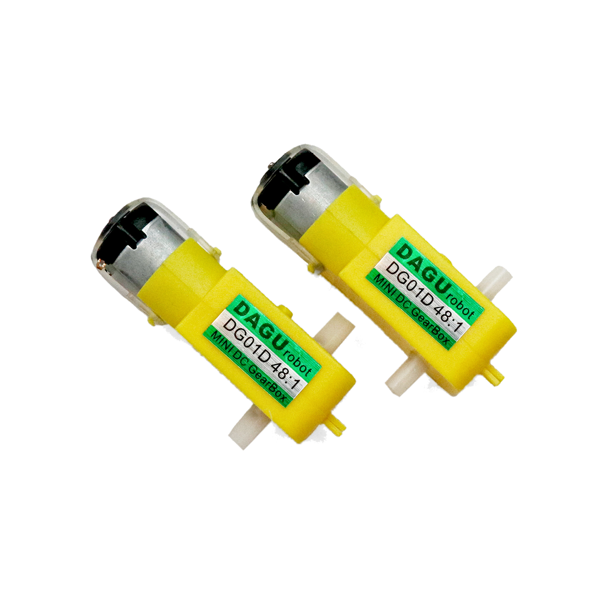

# Gleichstrommotor mit Getriebe

## Beschreibung

Ein Gleichstrom-Getriebe-Motor dreht solange, wie er an einer Spannungsquelle hängt.
Eine genaue Positionierung ist nur mit Hilfe von zusätzlichen Sensoren möglich.

<!-- more_details -->

Der **Unterschied** zum einfachen [Gleichstrommotor](/mks-welcome/part/mks-SeeedStudio-Grove_Relay/):
Der Getriebemotor besteht aus einem Gleichstrommotor mit aufgesetztem Getriebe.
Ein Getriebe verändert das _Verhältnis_ von Drehgeschwindigkeit zu verfügbarer Kraft.
Im Materialkoffer sind Motoren mit zwei Getriebevarianten enthalten.
Je höher die Übersetzung, desto langsamer dreht die _Abgabe-Achse_.
Gleichzeitig steigt die Kraft der _Abgabe-Achse_.

Die Steuerung erfolgt über ein einfaches Relais, einen Transistor, einen manuellen Schalter oder einen Motortreiber.

Falls du den Motor vom Arduino nur Ein und Aus Schalten möchtest, nutze einfach das [Relay](/mks-welcome/part/mks-SeeedStudio-Grove_Relay/).
Wenn eine Steuerung der Geschwindigkeit oder Drehrichtung nötig ist, verwendest du am besten den [Motortreiber](/mks-welcome/part/mks-SeeedStudio-Grove_I2C_Motor_Driver_V1.3/).
Schaue dort nach dem Beispiel für `DC-Motor`.

## Beispiele

!!!show-examples:./examples/

<!-- infolist -->

@[youtube](https://www.youtube.com/watch?v=wVxcmO2YuxA)

## Projektbeispiele:

- [Arduino-Tutorial - DC Motor Steuerung](https://www.arduino-tutorial.de/motorsteuerung-direkt-per-arduino/)

## Weiterführende Hintergrundinformationen:

- [Adafruit Gleichstrommotor](https://www.adafruit.com/product/711)
- [Produktseite](https://www.exp-tech.de/4298/dagu-dc-gear-motor-paar-90-degree-shaft-48-1) [- DC Motor mit Getriebe 48:1](https://www.exp-tech.de/4298/dagu-dc-gear-motor-paar-90-degree-shaft-48-1)
- [Produktseite - DC Motor mit Getriebe 380:1](https://www.exp-tech.de/motoren/dc-getriebemotoren/9496/380-1-micro-metal-gearmotor-hpcb-6v-with-extended-motor-shaft?c=1198)
- [GPIO - Wikipedia Artikel](https://de.wikipedia.org/wiki/Allzweckeingabe/-ausgabe)
- [Gleichstrommotor - Wikipedia Artikel](https://de.wikipedia.org/wiki/Gleichstrommaschine)
- [Übersetzung - Wikipedia Artikel](<https://de.wikipedia.org/wiki/%C3%9Cbersetzung_(Technik)>)
